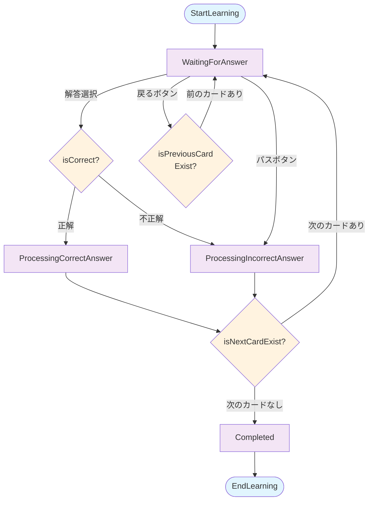

```mermaid
flowchart TD
    Start([StartLearning]) --> WaitingForAnswer[WaitingForAnswer]
    
    WaitingForAnswer -->|解答選択| isCorrect{isCorrect?}
    isCorrect -->|正解| ProcessingCorrectAnswer[ProcessingCorrectAnswer]
    isCorrect -->|不正解| ProcessingIncorrectAnswer[ProcessingIncorrectAnswer]
    WaitingForAnswer -->|パスボタン| ProcessingIncorrectAnswer
    
    ProcessingCorrectAnswer --> isNextCardExist{isNextCardExist?}
    ProcessingIncorrectAnswer --> isNextCardExist
    
    isNextCardExist -->|次のカードあり| WaitingForAnswer
    isNextCardExist -->|次のカードなし| Completed[Completed]
    
    Completed --> End([EndLearning])
    
    WaitingForAnswer -->|戻るボタン| isPreviousCardExist{isPreviousCard<br>Exist?}
    isPreviousCardExist -->|前のカードあり| WaitingForAnswer
    
    classDef startEnd fill:#e1f5fe
    classDef process fill:#f3e5f5
    classDef decision fill:#fff3e0
    
    class Start,End startEnd
    class WaitingForAnswer,ProcessingCorrectAnswer,ProcessingIncorrectAnswer,Completed process
    class isCorrect,isNextCardExist,isPreviousCardExist decision
```